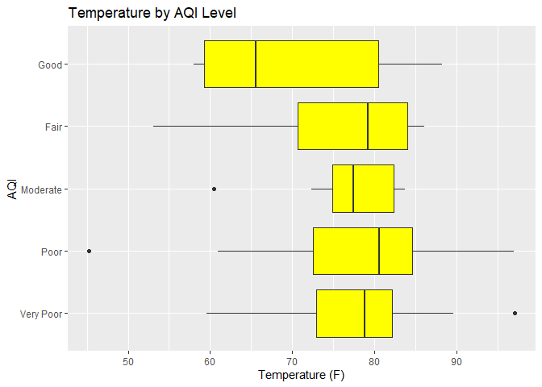
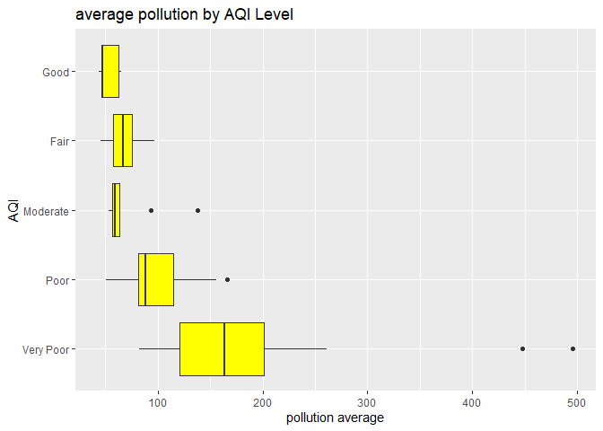

README
================
Craig Lazarski
September 20, 2021

Libraries required for contacting the API

``` r
library("tidyverse")
library("httr")
library("jsonlite")
mykey <- "c8d2a45a584ae7bff7eabb69d4d3fed4"
```

# Functions for gathering data from the Weather API

All of the functions are written so that the user inputs a city in the form of "city name, country code" and their key.

## `temp_info`

The `temp_info` function gathers the current temperature, feels like temperature, min temperature for the day, max temperature for the data, air pressure and humidity. The temperature values are all converted to Faharenheit degrees. The results are returned as a tibble.

``` r
# Function to gather temperature data from a city

temp_info <- function(city, key){
# Construct the call
base <- ("http://api.openweathermap.org/data/2.5/weather?q=")
city <- (city)
code <- ("&APPID=")
key <- (key)

#Make the call
weather <- GET(paste0(base,city,code,key))

# Parse the data
weather_data <- fromJSON(weather$url, flatten = TRUE)

# Data from the main component of the API
current_temp <- (weather_data$main$temp  - 273.16)*1.8 + 32
feels_like <- (weather_data$main$feels_like - 273.16)*1.8 + 32
min_temp <- (weather_data$main$temp_min - 273.16)*1.8 + 32
max_temp <- (weather_data$main$temp_max - 273.16)*1.8 + 32
pressure <- weather_data$main$pressure
humidity <- weather_data$main$humidity

# Store the data as a tibble
temp_data <- tibble(current_temp, feels_like, min_temp,max_temp, pressure, humidity)

return(temp_data)
}
```

## `wind_info`

The `wind_info` function gathers data about current visibility conditions in a city along with the wind speed and angle. The wind angle is an angle measured from North. I wrote code to convert this to a wind direction that is more intuititive to understand. The results are returned as a tibble.

``` r
# Function to gather wind data from a city

wind_info <- function(city, key){

# Construct the call
base <- ("http://api.openweathermap.org/data/2.5/weather?q=")
city <- (city)
code <- ("&APPID=")
key <- (key)

# Make the call
weather <- GET(paste0(base,city,code,key))

# Parse the data
weather_data <- fromJSON(weather$url, flatten = TRUE)

# Data from the visibility component
visibility <- weather_data$visibility

# Data from the wind component
wind_speed <- weather_data$wind$speed
wind_angle <- weather_data$wind$deg

# New variable that converts the wind degree to the direction the wind
# is coming from.
wind_direction <- ifelse(wind_angle >= 315, "North North West", ifelse(wind_angle >= 270, "West North West", ifelse(wind_angle >= 225, "West South West", ifelse(wind_angle >= 180, "South South West", ifelse(wind_angle >= 135, "South South East", ifelse(wind_angle >= 90, "East South East", ifelse(wind_angle >= 45, "East North East", "North North East")))))))

#Store the data as a tibble
wind_data <- tibble(visibility, wind_speed,wind_angle,wind_direction )

return(wind_data)
}
```

## `pollution_info`

The `pollution_info` function gathers the current measurements of 9 measured pollutants. It returns these as a tibble.

``` r
# Function to gather pollution information for a city
pollution_info <- function(city, key){
  
# Allow the user to input the city name rather than the coordinates 
  location <- coordinates(city,key)
  
# Construct the call
base <- ("http://api.openweathermap.org/data/2.5/air_pollution?")
lat <- ("lat=")
lattitude <- (location$lattitude)
long <- ("&lon=")
longitude <- (location$longitude)
code <- ("&APPID=")
key <- (key)

# Make the call
pollution <- GET(paste0(base,lat,lattitude,long,longitude,code,key))

# Parse the data
pollution_data <- fromJSON(pollution$url, flatten = TRUE)

# Data from the list component
co <- pollution_data$list$components.co
no <- pollution_data$list$components.no
no2 <- pollution_data$list$components.no2
o3 <- pollution_data$list$components.o3
so2 <- pollution_data$list$components.so2
pm2_5 <- pollution_data$list$components.pm2_5
pm10 <- pollution_data$list$components.pm10
nh3 <- pollution_data$list$components.nh3

#Store the data as a tibble
pollution_tibble <- tibble(co, no,no2, o3, so2, pm2_5, pm10, nh3)

return(pollution_tibble)
}
```

## `conditions_info`

The `conditions_info` function returns the current conditions such as "clear sky" or "Cloudy. It returns the information as a tibble.

``` r
# Function to gather description of current conditions from a city

conditions_info <- function(city, key){

# Construct the call
base <- ("http://api.openweathermap.org/data/2.5/weather?q=")
city <- (city)
code <- ("&APPID=")
key <- (key)

# Make the call
condition <- GET(paste0(base,city,code,key))

# Parse the data
condition_data <- fromJSON(condition$url, flatten = TRUE)

# Gather the data
condition_des <- condition_data$weather$description

# Return the data as a tibble
cond_data <- tibble(condition_des)

return(cond_data)
}
```

## `aqi_info`

The `aqi_info` returns the air quality index rating for a city. The stored data is an integer and the function returns a label from "very poor" to "Good" rather than the integer value.

``` r
# Function to gather air quality information for a city
aqi_info <- function(city, key){

# Allow the user to input the city name rather than the coordinates 
  location <- coordinates(city,key)
  
# Construct the call
base <- ("http://api.openweathermap.org/data/2.5/air_pollution?")
lat <- ("lat=")
lattitude <- (location$lattitude)
long <- ("&lon=")
longitude <- (location$longitude)
code <- ("&APPID=")
key <- (key)

# Make the call
aqi_call <- GET(paste0(base,lat,lattitude,long,longitude,code,key))

# Parse the data
aqi_data <- fromJSON(aqi_call$url, flatten = TRUE)

# Data from the list component
aqi <- aqi_data$list$main.aqi

# New variable that converts the aqi number to a description
aqi_level <- ifelse(aqi >= 5, "Very Poor", ifelse(aqi>=4, "Poor", ifelse(aqi >= 3, "Moderate", ifelse(aqi >= 2, "Fair", "Good"))))

# Return the data as a tibble
aqi_tibble <- tibble(aqi_level)

return(aqi_tibble)
}
```

## `coordinates`

The `coordinates` function allows the use to input a city and it will return the coordinates of a city. This function is primarily used as a pass through function for the pollution and aqi functions. These functions require a latitude and longitude location to be inputted. Instead, the user can input a city and in those functions the coordinates function is called to convert the city to a lattitude and longitude so the information can be extracted.

``` r
# Function to gather coordinates of a city

coordinates <- function(city, key){

#Construct the call
base <- ("http://api.openweathermap.org/data/2.5/weather?q=")
city <- (city)
code <- ("&APPID=")
key <- (key)

#Make the call
coord <- GET(paste0(base,city,code,key))

# Parse the data
coord_data <- fromJSON(coord$url, flatten = TRUE)

# Gather the data
longitude <- coord_data$coord$lon
lattitude <- coord_data$coord$lat

# Return the data as a tibble
coordinates_data <- tibble(longitude, lattitude)

return(coordinates_data)
}
```

# Data analysis

I was interested in exploring the how the various pollution measures were related to each other and the other weather measures in the largest cities.

I found a data set that lists cities in the world by population and read that into R. I subsetted to focus on only cities with over 1 million people. I then added a new variable that created the appropriate lable for inputting into the functions: "city name, country abbreviation."

When I tried to read in all of the cities into the functions the API returned an error and I only received data for 13 of the cities. I decided to call the values in batches by subsetting the city data and reading in 10 cities at a time until I had 100 cities. I then stored this information for analysis.

``` r
# Read in a list of cities with large populations
cities <- read_csv("cities.csv")

# Subset the data to only focus on cities with populations over 1 Million people and to only focus on the columns with identifying information to use in the function calls.

city_data <- cities %>% filter(population >= 1000000) %>% select(city, country, iso2,lat, lng )

# Create a new variable that merges the city name and country abbreviation so it can be used in the function calls.

country_code <- paste0(city_data$city, ",",city_data$iso2)

# Add the new variable to the data frame.
city_data <- city_data %>% mutate(country_code)

# Function to get data from the API
get_api_data <- function(my_data){
  
# Get data for the cities
aqi_data <- lapply(my_data$country_code, FUN=aqi_info, key=mykey)

pollution_data <- lapply(my_data$country_code, FUN=pollution_info, key=mykey)

conditions_data <- lapply(my_data$country_code, FUN=conditions_info, key=mykey)

temp_data <- lapply(my_data$country_code, FUN=temp_info, key=mykey)

wind_data <- lapply(my_data$country_code, FUN=wind_info, key=mykey)

# Extract the data from the lists
aqi <- as.data.frame(do.call(rbind, aqi_data))
pollution <- as.data.frame(do.call(rbind, pollution_data))

temp <- as.data.frame(do.call(rbind, temp_data))
wind <- as.data.frame(do.call(rbind, wind_data))

# Merge the data into a single data frame
return( my_data %>% mutate(aqi, pollution, temp, wind))
}


# Used this code in chunks to get data
#all_results <- data.frame()
#all_results <- rbind(all_results ,get_api_data(city_data[12,]))
```

Cleaning up the Data: Once the data was read in observed that some of the variables needed better labels for their values. Specifically, I added a new variable that desribed the humidity, and two variables that gave ratings to the pollution levels for Carbon Dioxide (CO2) and Nitrouse Oxide (NO2) and Ozone (03).

``` r
# This is the data I collected on 9/28/2021 at 7:00 PM
city_data <- read_csv("city_info.txt")

# Take out Jakarta as it is an extreme outlier.
city_data <- city_data[-2,]
# New variable regarding humidity
city_data <- city_data %>% mutate(humidity_level = 
  if_else(humidity >= 70, "Intolerable", 
    if_else(humidity >= 64, "Uncomfortable", 
      if_else(humidity >= 60, "Sticky", 
        if_else(humidity >= 57, "Quite noticeable", 
          if_else(humidity >= 53, "slightly noticeable","comfortable"))))))

# New Variable for CO levels

city_data <- city_data %>% mutate(CO2_level = if_else(co > 300, "Harmful", if_else(co >= 200, "Very Unhealthy", if_else(co >= 101, "Unhealthy", if_else(co >= 51, "Medium", "Good")))))

# New Variable for N02 levels
city_data <- city_data %>% mutate(no2_level = if_else(no2 >= 400, "Very Poor", if_else(no2 >= 200, "Poor", if_else(no2 >=100, "Moderate", if_else(no2 >= 50, "Fair", "Good")))))

# New variable for 03
city_data <- city_data %>% mutate( o3_level = if_else(o3 >= 240, "Very Poor", if_else(o3 >= 180, "Poor", if_else(o3 >= 120, "Moderate", if_else(o3 >= 60, "Fair", "Good")))))

city_data$aqi_level <- factor(city_data$aqi_level, levels=c("Very Poor", "Poor", "Moderate", "Fair", "Good"))
```

Explorataory Analysis: What is the current temperature of these countries?

Histogram of temperatures:

``` r
hist_plot <- ggplot(data= city_data, aes(x=current_temp)) +
  geom_histogram(binwidth=5, fill = "blue", color = "Black") +
  labs(title = "Current Temperatures") +
  xlab("Temperature (F)") +
  ylab("Count")

hist_plot
```


``` r
city_data %>%  summarise(avg = mean(current_temp), median = median(current_temp), sd = sd(current_temp))
```

    ## # A tibble: 1 x 3
    ##     avg median    sd
    ##   <dbl>  <dbl> <dbl>
    ## 1  71.4   71.6  8.66

Is there any relationship between temperature and AQI level?

``` r
box_plot <- ggplot(data= city_data, aes(x=current_temp, y=aqi_level)) +
  geom_boxplot(fill="yellow") +
  labs(title = "Temperature by AQI Level") +
  xlab("Temperature (F)") +
  ylab("AQI")

box_plot
```


The better air quality countries have lower temperatures. For fair through very poor ratings the temperatures seem to be fairly similar.

Let's explore the air quality index of countries.

``` r
bar_plot <- ggplot(data = city_data, aes(x=aqi_level)) +
  geom_bar(fill = "red", color = "black") +
  labs(title = "AQI Levels") +
  xlab("AQI") +
  ylab("Number of countries")
       
bar_plot
```


It appears that the majority of countries have a "very poor" air quality rating. This is disappointing

What is the relationship between the AQI index and the ozone level?

Summary statistics for Ozone

``` r
city_data %>% group_by(aqi_level) %>% summarise(avg = mean(o3), median = median(o3), sd = sd(o3))
```

    ## # A tibble: 5 x 4
    ##   aqi_level   avg median    sd
    ##   <fct>     <dbl>  <dbl> <dbl>
    ## 1 Very Poor  15.3   4.88  29.7
    ## 2 Poor       19.0   7.87  22.9
    ## 3 Moderate   68.2  34.3   72.6
    ## 4 Fair       31.1  28.6   25.3
    ## 5 Good       37.3  35.4   23.0

``` r
# Table of AQI vs Ozone
cont_table2 <- table(city_data$aqi_level, city_data$o3_level)
cont_table2
```

    ##            
    ##             Fair Good Moderate Poor
    ##   Very Poor    2   51        0    1
    ##   Poor         1   14        0    0
    ##   Moderate     0    2        1    0
    ##   Fair         2   10        0    0
    ##   Good         2   11        0    0

Most countries appear to have a "good" ozone rating. There does not seem to be much of a relationship between the AQI and Ozone rating since the spread in the Good Ozone rating is fairly evenly distributed.

``` r
bar_plot3 <- ggplot(data = city_data, aes(x=aqi_level)) +
  geom_bar(aes(fill=o3_level), color = "black") +
  labs(title = "AQI Levels") +
  xlab("AQI") +
  ylab("Number of countries")
       
bar_plot3
```


The bar plot shows that within each AQI rating most countries have a "good" ozone rating.

``` r
box_plot3 <- ggplot(data= city_data, aes(x=o3, y=aqi_level)) +
  geom_boxplot(fill="yellow") +
  labs(title = "O3 by AQI Level") +
  xlab("CO") +
  ylab("AQI")
box_plot3
```


Ozone does not appear to be a strong component of the AQI rating. While there is a general increasing trend from very poor to Good in terms of the amount of Ozone present, there is a lot of overlap in the boxplots indicating that a specific level of ozone may not translate to a AQI rating.

What is the relationship between the AQI and Carbon Monoxide levels?

Summary Statistics for CO2 levels at the different AQI indices.

``` r
city_data %>% group_by(aqi_level) %>% summarise(avg = mean(co), median = median(co), sd = sd(co))
```

    ## # A tibble: 5 x 4
    ##   aqi_level   avg median     sd
    ##   <fct>     <dbl>  <dbl>  <dbl>
    ## 1 Very Poor 1242.   858. 1074. 
    ## 2 Poor       841.   574.  908. 
    ## 3 Moderate   581.   654.  233. 
    ## 4 Fair       407.   404.   90.6
    ## 5 Good       322.   310.   58.6

``` r
# Table of AQI Vs Carbon Monoxide
cont_table3 <- table(city_data$aqi_level, city_data$CO2_level)
cont_table3
```

    ##            
    ##             Harmful Very Unhealthy
    ##   Very Poor      52              2
    ##   Poor           15              0
    ##   Moderate        3              0
    ##   Fair           10              2
    ##   Good            7              6

The only categories of CO2 present in the data are harmful and very unhealthy.67 Countries have harmful co2 levels and have very poor or poor AQI levels. CO2 appears to have more of an impact on AQI than Ozone.

``` r
bar_plot2 <- ggplot(data = city_data, aes(x=aqi_level)) +
  geom_bar(aes(fill=CO2_level), color = "black") +
  labs(title = "AQI Levels") +
  xlab("AQI") +
  ylab("Number of countries")
bar_plot2
```


Again we are seeing that in every AQI category the majority of countries have harmful levels of CO2.

What is the difference in CO2 levels by AQI index?

``` r
box_plot3 <- ggplot(data= city_data, aes(x=co, y=aqi_level)) +
  geom_boxplot(fill="yellow") +
  labs(title = "CO2 by AQI Level") +
  xlab("CO") +
  ylab("AQI")
box_plot3
```



The range of CO2 levels per AQI index appears to be rather small. The graph shows that as the AQI becomes worse that the CO2 increases at a fairly fixed rate indicating CO2 is a strong component of AQI.

How are Ozone and Carbon Monoxide related to each other?

``` r
scatter1 <- ggplot(data= city_data, aes(x=o3, y=co)) +
  geom_point() +
  ggtitle("Ozone by Carbon Monoxide") +
  xlab("Ozone") +
  ylab("Carbon Monoxide")
scatter1
```


There does not appear to be a linear relationship. There appears to be an almost power relationship between Ozone and Carbon Monixde levels. A logarithmic transformation of both variables may yield a more interesting relationship.

Transformed data:

``` r
scatter1 <- ggplot(data= city_data, aes(x=log(o3), y=log(co))) +
  geom_point() +
  ggtitle("Ozone by Carbon Monoxide") +
  xlab("Ozone") +
  ylab("Carbon Monoxide")
scatter1
```


I was right! There now appears to be a linear trend between the log of both variables.

``` r
scatter1 + stat_smooth(method = "lm", col = "red")
```

    ## `geom_smooth()` using formula 'y ~ x'

    ## Warning: Removed 1 rows containing non-finite values (stat_smooth).



There appears to be a moderate negative relationship (R^2 = 0.463 ) between the log of CO2 and the log of Ozone.
