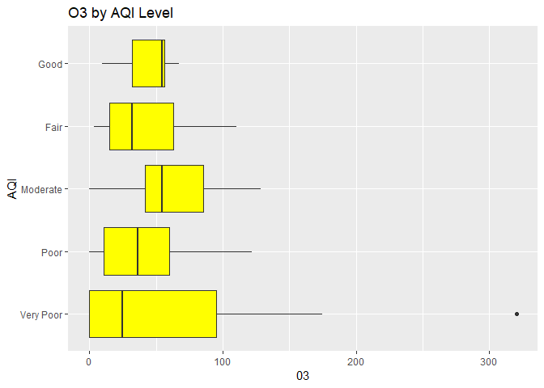
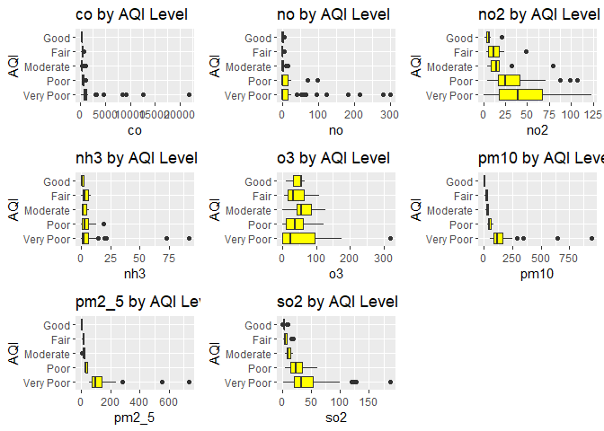

README
================
Craig Lazarski
September 20, 2021

Libraries required for contacting the API

``` r
library("tidyverse")
library("httr")
library("jsonlite")
library("cowplot")

mykey <- "c8d2a45a584ae7bff7eabb69d4d3fed4"
```

# Functions for gathering data from the Weather API

All of the functions are written so that the user inputs a city in the form of "city name, country code" and their key. The API is not case sensitive and is able to handle extra white spaces so it is fairly user friendly already. The API for air quality and pollution levels require the user to input lattitude and longitude coordinates. A coordinates function is used to gather this information when needed so the user can still simply input a city and country.

## `temp_info`

The `temp_info` function gathers the current temperature, feels like temperature, min temperature for the day, max temperature for the data, air pressure and humidity. The temperature values are all converted to Faharenheit degrees. The results are returned as a tibble.

``` r
# Function to gather temperature data from a city

temp_info <- function(city, key){
# Construct the call
base <- ("http://api.openweathermap.org/data/2.5/weather?q=")
city <- (city)
code <- ("&APPID=")
key <- (key)

#Make the call
weather <- GET(paste0(base,city,code,key))

# Parse the data
weather_data <- fromJSON(weather$url, flatten = TRUE)

# Data from the main component of the API
current_temp <- (weather_data$main$temp  - 273.16)*1.8 + 32
feels_like <- (weather_data$main$feels_like - 273.16)*1.8 + 32
min_temp <- (weather_data$main$temp_min - 273.16)*1.8 + 32
max_temp <- (weather_data$main$temp_max - 273.16)*1.8 + 32
pressure <- weather_data$main$pressure
humidity <- weather_data$main$humidity

# Store the data as a tibble
temp_data <- tibble(current_temp, feels_like, min_temp,max_temp, pressure, humidity)

return(temp_data)
}
```

## `wind_info`

The `wind_info` function gathers data about current visibility conditions in a city along with the wind speed and angle. The wind angle is an angle measured from North. I wrote code to convert this to a wind direction that is more intuititive to understand. The results are returned as a tibble.

``` r
# Function to gather wind data from a city

wind_info <- function(city, key){

# Construct the call
base <- ("http://api.openweathermap.org/data/2.5/weather?q=")
city <- (city)
code <- ("&APPID=")
key <- (key)

# Make the call
weather <- GET(paste0(base,city,code,key))

# Parse the data
weather_data <- fromJSON(weather$url, flatten = TRUE)

# Data from the visibility component
visibility <- weather_data$visibility

# Data from the wind component
wind_speed <- weather_data$wind$speed
wind_angle <- weather_data$wind$deg

# New variable that converts the wind degree to the direction the wind
# is coming from.
wind_direction <- ifelse(wind_angle >= 315, "North North West", ifelse(wind_angle >= 270, "West North West", ifelse(wind_angle >= 225, "West South West", ifelse(wind_angle >= 180, "South South West", ifelse(wind_angle >= 135, "South South East", ifelse(wind_angle >= 90, "East South East", ifelse(wind_angle >= 45, "East North East", "North North East")))))))

#Store the data as a tibble
wind_data <- tibble(visibility, wind_speed,wind_angle,wind_direction )

return(wind_data)
}
```

## `pollution_info`

The `pollution_info` function gathers the current measurements of 9 measured pollutants. It returns these as a tibble.

``` r
# Function to gather pollution information for a city
pollution_info <- function(city, key){
  
# Allow the user to input the city name rather than the coordinates 
  location <- coordinates(city,key)
  
# Construct the call
base <- ("http://api.openweathermap.org/data/2.5/air_pollution?")
lat <- ("lat=")
lattitude <- (location$lattitude)
long <- ("&lon=")
longitude <- (location$longitude)
code <- ("&APPID=")
key <- (key)

# Make the call
pollution <- GET(paste0(base,lat,lattitude,long,longitude,code,key))

# Parse the data
pollution_data <- fromJSON(pollution$url, flatten = TRUE)

# Data from the list component
co <- pollution_data$list$components.co
no <- pollution_data$list$components.no
no2 <- pollution_data$list$components.no2
o3 <- pollution_data$list$components.o3
so2 <- pollution_data$list$components.so2
pm2_5 <- pollution_data$list$components.pm2_5
pm10 <- pollution_data$list$components.pm10
nh3 <- pollution_data$list$components.nh3

#Store the data as a tibble
pollution_tibble <- tibble(co, no,no2, o3, so2, pm2_5, pm10, nh3)

return(pollution_tibble)
}
```

## `conditions_info`

The `conditions_info` function returns the current conditions such as "clear sky" or "Cloudy". It returns the information as a tibble.

``` r
# Function to gather description of current conditions from a city

conditions_info <- function(city, key){

# Construct the call
base <- ("http://api.openweathermap.org/data/2.5/weather?q=")
city <- (city)
code <- ("&APPID=")
key <- (key)

# Make the call
condition <- GET(paste0(base,city,code,key))

# Parse the data
condition_data <- fromJSON(condition$url, flatten = TRUE)

# Gather the data
condition_des <- condition_data$weather$description

# Return the data as a tibble
cond_data <- tibble(condition_des)

return(cond_data)
}
```

## `aqi_info`

The `aqi_info` returns the air quality index rating for a city. The stored data is an integer and the function returns a label from "very poor" to "Good" rather than the integer value.

``` r
# Function to gather air quality information for a city
aqi_info <- function(city, key){

# Allow the user to input the city name rather than the coordinates 
  location <- coordinates(city,key)
  
# Construct the call
base <- ("http://api.openweathermap.org/data/2.5/air_pollution?")
lat <- ("lat=")
lattitude <- (location$lattitude)
long <- ("&lon=")
longitude <- (location$longitude)
code <- ("&APPID=")
key <- (key)

# Make the call
aqi_call <- GET(paste0(base,lat,lattitude,long,longitude,code,key))

# Parse the data
aqi_data <- fromJSON(aqi_call$url, flatten = TRUE)

# Data from the list component
aqi <- aqi_data$list$main.aqi

# New variable that converts the aqi number to a description
aqi_level <- ifelse(aqi >= 5, "Very Poor", ifelse(aqi>=4, "Poor", ifelse(aqi >= 3, "Moderate", ifelse(aqi >= 2, "Fair", "Good"))))

# Return the data as a tibble
aqi_tibble <- tibble(aqi_level)

return(aqi_tibble)
}
```

## `coordinates`

The `coordinates` function allows the use to input a city and it will return the coordinates of a city. This function is primarily used as a pass through function for the pollution and aqi functions. These functions require a latitude and longitude location to be inputted. Instead, the user can input a city and in those functions the coordinates function is called to convert the city to a lattitude and longitude so the information can be extracted.

``` r
# Function to gather coordinates of a city

coordinates <- function(city, key){

#Construct the call
base <- ("http://api.openweathermap.org/data/2.5/weather?q=")
city <- (city)
code <- ("&APPID=")
key <- (key)

#Make the call
coord <- GET(paste0(base,city,code,key))

# Parse the data
coord_data <- fromJSON(coord$url, flatten = TRUE)

# Gather the data
longitude <- coord_data$coord$lon
lattitude <- coord_data$coord$lat

# Return the data as a tibble
coordinates_data <- tibble(longitude, lattitude)

return(coordinates_data)
}
```

# Data analysis

I was interested in exploring the how the various pollution measures were related to each other and also how they are related to other weather measures in the largest cities of the world.

I found a data set that lists cities in the world by population and read that into R (The file can be found in the repo: "cities.csv". I subsetted the data to focus on only cities with over 1 million people. I then added a new variable that created the appropriate label for inputting into the functions: "city name, country abbreviation."

``` r
# Note I have turned off this chunk. It gathers the data but because it querries the API so many times it will lock the user out shortly after.

# Read in a list of cities with large populations

cities <- read_csv("cities.csv")

# Subset the data to only focus on cities with populations over 1 Million people and to only focus on the columns with identifying information to use in the function calls.

city_data <- cities %>% filter(population >= 1000000) %>% select(city_ascii, country, iso2,lat, lng ,population)

# Create a new variable that merges the city name and country abbreviation so it can be used in the function calls.

country_code <- paste0(city_data$city_ascii, ",",city_data$iso2)

# Add the new variable to the data frame.
city_data <- city_data %>% mutate(country_code)


# Function to get data from the API
get_api_data <- function(my_data){

# Get data for the cities
aqi_data <- lapply(my_data$country_code, FUN=aqi_info, key=mykey)

pollution_data <- lapply(my_data$country_code, FUN=pollution_info, key=mykey)

conditions_data <- lapply(my_data$country_code, FUN=conditions_info, key=mykey)

temp_data <- lapply(my_data$country_code, FUN=temp_info, key=mykey)

wind_data <- lapply(my_data$country_code, FUN=wind_info, key=mykey)

# Extract the data from the lists
aqi <- as.data.frame(do.call(rbind, aqi_data))
pollution <- as.data.frame(do.call(rbind, pollution_data))

temp <- as.data.frame(do.call(rbind, temp_data))
wind <- as.data.frame(do.call(rbind, wind_data))

# Merge the data into a single data frame
return( my_data %>% mutate(aqi, pollution, temp, wind))
}

# Querrying the API for many cities can be very time consuming and may get me locked out of the API so I restricted my focus to the largest 100 cities.

city_data <- city_data %>% arrange(desc(population)) %>% slice(1:100) 

all_results <- data.frame()

all_results <- rbind(all_results ,get_api_data(city_data))

# Write the data collected to a file so I don't have to call the API again.

write_csv(all_results, "project_data.csv")
```

Cleaning up the Data: Once the data was read in observed that some of the variables needed better labels for their values. Specifically, I added a new variable that desribed the humidity, and two variables that gave ratings to the pollution levels for Carbon Dioxide (CO2) and Nitrouse Oxide (NO2) and Ozone (03).

``` r
# This is the data I collected on 10/3/2021 at 10:00 AM
city_data <- read_csv("project_data.csv")


# New variable regarding humidity
city_data <- city_data %>% mutate(humidity_level = 
  if_else(humidity >= 70, "Intolerable", 
    if_else(humidity >= 64, "Uncomfortable", 
      if_else(humidity >= 60, "Sticky", 
        if_else(humidity >= 57, "Quite noticeable", 
          if_else(humidity >= 53, "slightly noticeable","comfortable"))))))

# New Variable for CO levels

city_data <- city_data %>% mutate(CO_level = if_else(co > 300, "Harmful", if_else(co >= 200, "Very Unhealthy", if_else(co >= 101, "Unhealthy", if_else(co >= 51, "Medium", "Good")))))

# New Variable for N02 levels
city_data <- city_data %>% mutate(no2_level = if_else(no2 >= 400, "Very Poor", if_else(no2 >= 200, "Poor", if_else(no2 >=100, "Moderate", if_else(no2 >= 50, "Fair", "Good")))))

# New variable for 03
city_data <- city_data %>% mutate( o3_level = if_else(o3 >= 240, "Very Poor", if_else(o3 >= 180, "Poor", if_else(o3 >= 120, "Moderate", if_else(o3 >= 60, "Fair", "Good")))))

city_data$aqi_level <- factor(city_data$aqi_level, levels=c("Very Poor", "Poor", "Moderate", "Fair", "Good"))

# New variable for the difference in temperatures
city_data <- city_data %>% mutate(temp_diff = max_temp - min_temp)
```

Explorataory Analysis: What is the current temperature of these countries?

Histogram of current temperatures:

``` r
temp_plot <- ggplot(data= city_data, aes(x=current_temp)) +
  geom_histogram(binwidth=5, fill = "blue", color = "Black") +
  labs(title = "Temperatures") +
  xlab("Temperature (F)") +
  ylab("Count")

temp_plot
```

 It appears that regardless of time zone, the largest 100 cities have temperatures in a comfy zone of 65 to 85 degrees F.

``` r
city_data %>%  summarise(avg = mean(current_temp), median = median(current_temp), sd = sd(current_temp))
```

    ## # A tibble: 1 x 3
    ##     avg median    sd
    ##   <dbl>  <dbl> <dbl>
    ## 1  76.3   78.8  9.24

The summary measures support that the typical temperatures across the globe for these cities are between 65 and 85 degrees F.

Is there any relationship between temperature and AQI level?

``` r
box_plot <- ggplot(data= city_data, aes(x=current_temp, y=aqi_level)) +
  geom_boxplot(fill="yellow") +
  labs(title = "Temperature by AQI Level") +
  xlab("Temperature (F)") +
  ylab("AQI")

box_plot
```


The better air quality countries have lower temperatures. For fair through very poor ratings the temperatures seem to be fairly similar. There does not seem to be much of a relationship between temperature and air quality.

Let's explore the air quality index of countries.

``` r
bar_plot <- ggplot(data = city_data, aes(x=aqi_level)) +
  geom_bar(fill = "red", color = "black") +
  labs(title = "AQI Levels") +
  xlab("AQI") +
  ylab("Number of countries")
       
bar_plot
```


It appears that the majority of countries have a "very poor" air quality rating. This is disappointing

``` r
boxplot
```

    ## function (x, ...) 
    ## UseMethod("boxplot")
    ## <bytecode: 0x000000000d6861c8>
    ## <environment: namespace:graphics>

``` r
bp_co <- ggplot(data= city_data, aes(x=co, y=aqi_level)) +
  geom_boxplot(fill="yellow") +
  labs(title = "co by AQI Level") +
  xlab("co") +
  ylab("AQI")

bp__no <- ggplot(data= city_data, aes(x=no, y=aqi_level)) +
  geom_boxplot(fill="yellow") +
  labs(title = "no by AQI Level") +
  xlab("no") +
  ylab("AQI")

bp_no2 <- ggplot(data= city_data, aes(x=no2, y=aqi_level)) +
  geom_boxplot(fill="yellow") +
  labs(title = "no2 by AQI Level") +
  xlab("no2") +
  ylab("AQI")

bp_o3 <- ggplot(data= city_data, aes(x=o3, y=aqi_level)) +
  geom_boxplot(fill="yellow") +
  labs(title = "o3 by AQI Level") +
  xlab("o3") +
  ylab("AQI")

bp_so2 <- ggplot(data= city_data, aes(x=so2, y=aqi_level)) +
  geom_boxplot(fill="yellow") +
  labs(title = "so2 by AQI Level") +
  xlab("so2") +
  ylab("AQI")

bp_nh3 <- ggplot(data= city_data, aes(x=nh3, y=aqi_level)) +
  geom_boxplot(fill="yellow") +
  labs(title = "nh3 by AQI Level") +
  xlab("nh3") +
  ylab("AQI")

bp_pm2_5 <- ggplot(data= city_data, aes(x=pm2_5, y=aqi_level)) +
  geom_boxplot(fill="yellow") +
  labs(title = "pm2_5 by AQI Level") +
  xlab("pm2_5") +
  ylab("AQI")

bp_pm10 <- ggplot(data= city_data, aes(x=pm10, y=aqi_level)) +
  geom_boxplot(fill="yellow") +
  labs(title = "pm10 by AQI Level") +
  xlab("pm10") +
  ylab("AQI")

plot_grid(bp_co, bp__no, bp_no2, bp_nh3, bp_o3, bp_pm10, bp_pm2_5, bp_so2)
```


Several pollutants behave as expected. no2, so2, pm\_10, and pm2\_5 all share a pattern that as their levels increase the aqi decreases. Ozone (o3) stands out as this pattern is not present at all. co, no, and nh3 are hard to determine as they have outliers that are stretching the scales and making it hard to read the graphs.

I am going to explore Ozone in more detail and Carbon Monoxide (co). Ozone because of it's lack of pattern and Carbon Monoxide since it was hard to determine what was going on based on the graph presented.

What is the relationship between the AQI index and the ozone level?

Summary statistics for Ozone

``` r
city_data %>% group_by(aqi_level) %>% summarise(avg = mean(o3), median = median(o3), sd = sd(o3))
```

    ## # A tibble: 5 x 4
    ##   aqi_level   avg median    sd
    ##   <fct>     <dbl>  <dbl> <dbl>
    ## 1 Very Poor  51.5   24.7  64.0
    ## 2 Poor       40.2   36.3  34.9
    ## 3 Moderate   59.0   54.4  40.2
    ## 4 Fair       38.9   32.2  31.4
    ## 5 Good       45.9   54.4  18.5

There is no clear Ozone level that fits in the AQI groupings. Moderate and Good have similar medians despite being very different AQI ratings.

``` r
# Table of AQI vs Ozone
cont_table2 <- table(city_data$aqi_level, city_data$o3_level)
cont_table2
```

    ##            
    ##             Fair Good Moderate Very Poor
    ##   Very Poor   12   33        5         1
    ##   Poor         4   13        1         0
    ##   Moderate     3    5        1         0
    ##   Fair         4    9        0         0
    ##   Good         2    7        0         0

Most countries appear to have a "good" ozone rating. There does not seem to be much of a relationship between the AQI and Ozone rating since the spread in the Good Ozone rating is fairly evenly distributed.

``` r
bar_plot3 <- ggplot(data = city_data, aes(x=aqi_level)) +
  geom_bar(aes(fill=o3_level), color = "black") +
  labs(title = "AQI Levels") +
  xlab("AQI") +
  ylab("Number of countries")
       
bar_plot3
```


The bar plot shows that within each AQI rating most countries have a "good" ozone rating.

``` r
box_plot3 <- ggplot(data= city_data, aes(x=o3, y=aqi_level)) +
  geom_boxplot(fill="yellow") +
  labs(title = "O3 by AQI Level") +
  xlab("03") +
  ylab("AQI")
box_plot3
```



Ozone does not appear to be a strong component of the AQI rating. While there is a general increasing trend from very poor to Good in terms of the amount of Ozone present, there is a lot of overlap in the boxplots indicating that a specific level of ozone may not translate to a AQI rating.

There is a very unusual observation that has an ozone rating over 300.

``` r
outlier <- city_data %>% filter(o3 >= 200)
outlier
```

    ## # A tibble: 1 x 31
    ##   city_ascii   country iso2    lat   lng population country_code  aqi_level    co
    ##   <chr>        <chr>   <chr> <dbl> <dbl>      <dbl> <chr>         <fct>     <dbl>
    ## 1 Rio de Jane~ Brazil  BR    -22.9 -43.2   12272000 Rio de Janei~ Very Poor 1028.
    ## # ... with 22 more variables: no <dbl>, no2 <dbl>, o3 <dbl>, so2 <dbl>,
    ## #   pm2_5 <dbl>, pm10 <dbl>, nh3 <dbl>, current_temp <dbl>, feels_like <dbl>,
    ## #   min_temp <dbl>, max_temp <dbl>, pressure <dbl>, humidity <dbl>,
    ## #   visibility <dbl>, wind_speed <dbl>, wind_angle <dbl>, wind_direction <chr>,
    ## #   humidity_level <chr>, CO_level <chr>, no2_level <chr>, o3_level <chr>,
    ## #   temp_diff <dbl>

The outlier in this data analysis is Rio de Janeiro. I searched on other websites and found the numbers I have from the API are possibily inaccurate. Since the data collected are current measures the values collected at the moment I querried may be unusual due to a sensor glitch or unusual reading at that moment. Using averaged values over time would be a better choice but my functions did not return that information and since I locked myself out of the API due to my previous querry we will have to work with what I have.

I am decided to remove Rio from this analysis and will assume that the other data points are valid.

``` r
city_data2 <- city_data %>% filter(o3 <= 200)

# Rerun the previous boxplot without the outlier.
box_plot4 <- ggplot(data= city_data2, aes(x=o3, y=aqi_level)) +
  geom_boxplot(fill="yellow") +
  labs(title = "O3 by AQI Level") +
  xlab("03") +
  ylab("AQI")
box_plot4
```

 Without the outlier the same conclusion is reached. Ozone does not appear to be a major contributing factor to the AQI value of a city.

What is the relationship between the AQI and Carbon Monoxide levels?

Summary Statistics for Carbon Monoxide (CO) levels at the different AQI indices.

``` r
city_data %>% group_by(aqi_level) %>% summarise(avg = mean(co), median = median(co), sd = sd(co))
```

    ## # A tibble: 5 x 4
    ##   aqi_level   avg median     sd
    ##   <fct>     <dbl>  <dbl>  <dbl>
    ## 1 Very Poor 2009.   975. 3645. 
    ## 2 Poor       582.   527.  215. 
    ## 3 Moderate   416.   324.  239. 
    ## 4 Fair       457.   447.  138. 
    ## 5 Good       353.   340.   71.1

The "good" range has the least variation and the "very poor" range has the most. The average level of CO makes sense as the level increase as the AQI go from "good" to "very poor" however the median does not follow that trend. THe "good" rating actually has a higher median CO level than the "moderate" rating.

``` r
# Table of AQI Vs Carbon Monoxide
cont_table3 <- table(city_data$aqi_level, city_data$CO_level)
cont_table3
```

    ##            
    ##             Harmful Very Unhealthy
    ##   Very Poor      50              1
    ##   Poor           17              1
    ##   Moderate        7              2
    ##   Fair           11              2
    ##   Good            7              2

The only categories of CO present in the data are harmful and very unhealthy.67 Countries have harmful CO levels and have very poor or poor AQI levels. CO appears to have more of an impact on AQI than Ozone.

``` r
bar_plot2 <- ggplot(data = city_data, aes(x=aqi_level)) +
  geom_bar(aes(fill=CO_level), color = "black") +
  labs(title = "AQI Levels") +
  xlab("AQI") +
  ylab("Number of countries")
bar_plot2
```


Again we are seeing that in every AQI category the majority of countries have harmful levels of CO2.

What is the difference in CO2 levels by AQI index?

``` r
box_plot3 <- ggplot(data= city_data, aes(x=co, y=aqi_level)) +
  geom_boxplot(fill="yellow") +
  labs(title = "CO by AQI Level") +
  xlab("CO") +
  ylab("AQI")
box_plot3
```


The range of CO levels per AQI index appears to be rather small. The graph shows that as the AQI becomes worse that the CO increases at a fairly fixed rate indicating CO is a strong component of AQI.

Let's remove some of the outlier observations.

``` r
city_data3 <- city_data %>% filter(co <= 1000)

box_plot4 <- ggplot(data= city_data3, aes(x=co, y=aqi_level)) +
  geom_boxplot(fill="yellow") +
  labs(title = "CO by AQI Level") +
  xlab("CO") +
  ylab("AQI")
box_plot4
```


Removing the extreme observations it can now be observed that there is a general increasing trend in the median values from Good to Very Poor. However, the moderate category stands out in that it has the lowest median. This may be due to a lack of countries that fall into this category. From the first histogram it is evident that only 9 countries were classified as Moderate which is the lowest of all 5 categories.

How are Ozone and Carbon Monoxide related to each other?

``` r
# Since we are working with Ozone I will use the data that removed the outlier.
scatter1 <- ggplot(data= city_data2, aes(x=co, y=o3)) +
  geom_point() +
  ggtitle("Ozone by Carbon Monoxide") +
  xlab("Carbon Monoxide") +
  ylab("Ozone")
scatter1
```



There does not appear to be a linear relationship but the scales are very different so a transformation may yield more interesting results.

Transformed data:

``` r
scatter2 <- ggplot(data= city_data2, aes(x=log(co), y=o3)) +
  geom_point() +
  ggtitle("Ozone by Carbon Monoxide") +
  xlab("Carbon Monoxide") +
  ylab("Ozone")
scatter2
```


``` r
scatter3 <- ggplot(data = city_data2, aes(x=log1p(co), y=log(o3))) +
  geom_point() +
  ggtitle("Ozone by Carbon Monoxide") +
  xlab("Carbon Monoxide") +
  ylab("Ozone")
scatter3
```


The second scatterplot appears to have a more linear relationship and this one used the log of both variables. It appears a power model may be good fit.

``` r
scatter3 + stat_smooth(method = "lm", col = "red")
```

    ## `geom_smooth()` using formula 'y ~ x'

    ## Warning: Removed 14 rows containing non-finite values (stat_smooth).


``` r
model <- lm(log1p(o3) ~ log(co), data=city_data2)
summary(model)
```

    ## 
    ## Call:
    ## lm(formula = log1p(o3) ~ log(co), data = city_data2)
    ## 
    ## Residuals:
    ##     Min      1Q  Median      3Q     Max 
    ## -3.1399 -0.5362  0.1666  0.8017  3.1694 
    ## 
    ## Coefficients:
    ##             Estimate Std. Error t value Pr(>|t|)    
    ## (Intercept)  11.7633     1.0298  11.423  < 2e-16 ***
    ## log(co)      -1.3343     0.1557  -8.572 1.61e-13 ***
    ## ---
    ## Signif. codes:  0 '***' 0.001 '**' 0.01 '*' 0.05 '.' 0.1 ' ' 1
    ## 
    ## Residual standard error: 1.267 on 97 degrees of freedom
    ## Multiple R-squared:  0.431,  Adjusted R-squared:  0.4252 
    ## F-statistic: 73.48 on 1 and 97 DF,  p-value: 1.61e-13

There appears to be a weak negative relationship (R^2 = 0.4042) between the log of Ozone and log of CO. Doing some google research it appears that there is a positive correlation between Carbon Monoxide and Ozone which is not apparent in this data. Since this data is for one moment in time rather than average data over time we may not be able to see that same relationship.
